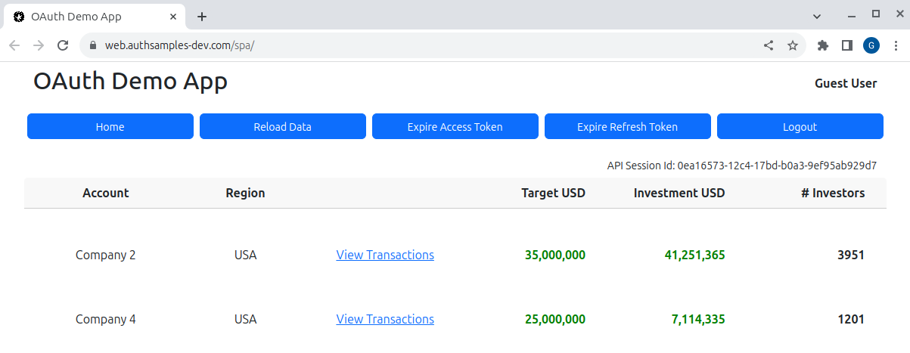

# OAuth Final SPA

[](https://www.codacy.com/gh/gary-archer/oauth.websample.final/dashboard?utm_source=github.com&amp;utm_medium=referral&amp;utm_content=gary-archer/oauth.websample.final&amp;utm_campaign=Badge_Grade)
 
[](https://snyk.io/test/github/gary-archer/oauth.websample.final?targetFile=spa/package.json)

## Overview

The final demo SPA, which aims for a [Web Architecture](https://authguidance.com/web-architecture-goals/) with best capabilities:

- The SPA uses an API driven OpenID Connect solution via **Curity's Token Handler Pattern**
- Only client side React technology is needed to implement the SPA, for productive development
- The SPA is deployed to many global locations via a Content Delivery Network (CDN)

## Components

The SPA architecture looks like this, where OAuth related components are hosted in the AWS cloud.\
This ensures that local web development is focused only on the React UI:


## Views

The SPA is a simple UI with some basic navigation between views, to render fictional resources.\
The data is returned from an API that authorizes access to resources using domain specific claims.



## Online System

The online version uses the AWS Cloudfront CDN to deliver static content to the browser.\
Login at https://web.authsamples.com/spa with this AWS Cognito test account:

```text
- User: guestuser@mycompany.com
- Password: GuestPassword1
```

## Local Development Quick Start

Build code locally via this command, which runs `npm install` and `npm start`:

```bash
./build.sh
```

Custom development domains are used so you must add this DNS entry to your hosts file:

```bash
127.0.0.1 localhost web.authsamples-dev.com
```

Next configure [Browser SSL Trust](https://authguidance.com/2017/11/11/developer-ssl-setup#browser) for the SSL root certificate:

```
./certs/authsamples-dev.ca.pem
```

Then run this script to run a simple web host that serves static content:

```bash
./deploy.sh
```

When the browser is invoked at https://web.authsamples-dev.com/spa, sign in with the test account.\
You can then test all lifecycle operations, including expiry events, multi-tab browsing and multi-tab logout.

## Further Information

* Further architecture details are described starting in the [Final SPA Overview](https://authguidance.com/2019/04/07/local-ui-setup) blog post
* See the [Non Functional Behaviour](https://authguidance.com/2017/10/08/corporate-code-sample-core-behavior/) page for a summary of overall qualities


## Programming Languages

* TypeScript and React are used to implement the SPA

## Infrastructure

* AWS Route 53 is used for custom hosting domains
* AWS S3 is used as the upload point for web static content
* AWS Cloudfront is used to distribute web static content globally, for equal web performance
* AWS Certificate Manager is used to manage and auto renew the Web Host's SSL certificate
* AWS Cognito is used as the default Authorization Server
* AWS API Gateway is used to host remote API endpoints used by the SPA
* AWS deployed [Backend for Frontend Components](https://authguidance.com/2019/09/09/spa-back-end-for-front-end) are used to perform OAuth and cookie work for the SPA

