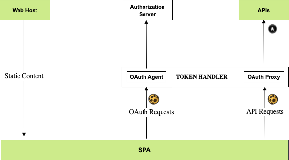
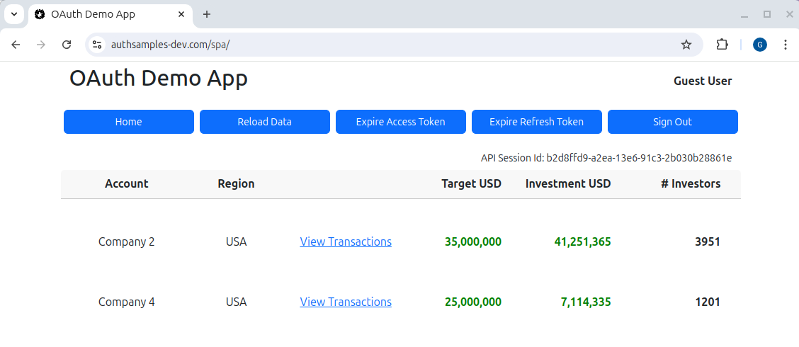

# OAuth Final SPA

[](https://app.codacy.com/gh/gary-archer/oauth.websample.final?utm_source=github.com&utm_medium=referral&utm_content=gary-archer/oauth.websample.final&utm_campaign=Badge_Grade)
 
[](https://snyk.io/test/github/gary-archer/oauth.websample.final?targetFile=spa/package.json)
[](https://snyk.io/test/github/gary-archer/oauth.websample.final?targetFile=webhost/package.json)

## Overview

The final demo Single Page Application, which aims to meet some [Web Architecture Goals](https://apisandclients.com/posts/web-architecture-goals).\
The `Token Handler Pattern` enables the following main behaviors:

- The SPA uses the most secure cookies with no tokens in the browser, to limit the impact of XSS exploits.
- The SPA uses modern productive development with only client side React technology.
- The SPA static content is distributed to ~400 global locations by a content delivery network, for best web performance.
  
## Components

Cookies are managed solely by OAuth Agent and OAuth Proxy utility components on the API side of the architecture:



## Views

The SPA is a simple UI with some basic navigation between views, to render fictional investment resources.\
Its data is returned from an OAuth-secured API that uses claims-based authorization.\
The SPA uses user attributes from both the OpenID Connect userinfo endpoint and its API. 



## Online System

The online version uses the AWS Cloudfront CDN to deliver static content to the browser.\
Login at https://www.authsamples.com/ with this AWS Cognito test account:

```text
- User: guestuser@example.com
- Password: GuestPassword1
```

## Local Development Quick Start

First ensure that Node.js 20+ is installed.\
Then build code locally via this command, which runs `npm install` and `npm start`:

```bash
./build.sh
```

You must use custom development domains and add this DNS entry to your hosts file:

```bash
127.0.0.1 localhost www.authsamples-dev.com
```

Next, configure [Browser SSL Trust](https://apisandclients.com/posts/developer-ssl-setup) for the SSL root certificate:

```
./certs/authsamples-dev.ca.crt
```

Then run this script in another terminal window to run a simple web host that serves static content.\
You can edit the SPA's React code and update the UI productively, in a pure SPA manner.

```bash
./run.sh
```

When the browser is invoked at `https://www.authsamples-dev.com/`, sign in with the test account.\
You can then test all lifecycle operations, including expiry events, multi-tab browsing and multi-tab logout.

## Further Information

* See the [API Journey - Client Side](https://apisandclients.com/posts/api-journey-client-side) for further information on the app's behaviour.
* See blog posts for further details specific to the, starting in the [Final SPA Overview](https://apisandclients.com/posts/final-spa-overview).

## Programming Languages

* The app's code uses TypeScript and its views use React.

## Infrastructure

* AWS Route 53 provides custom hosting domains.
* AWS S3 is the upload point for web static content.
* AWS Cloudfront distributes web static content globally, for equal web performance.
* AWS Certificate Manager issues and auto renews the web host's SSL certificate.
* AWS Cognito is the default authorization server for the SPA and API components.
* [AWS Serverless](https://github.com/gary-archer/oauth.apisample.serverless) or Kubernetes host remote API endpoints that the SPA calls.
* Token handler components implement API-driven cookie issuing on behalf of the SPA.

